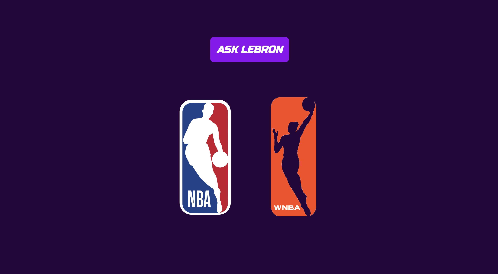
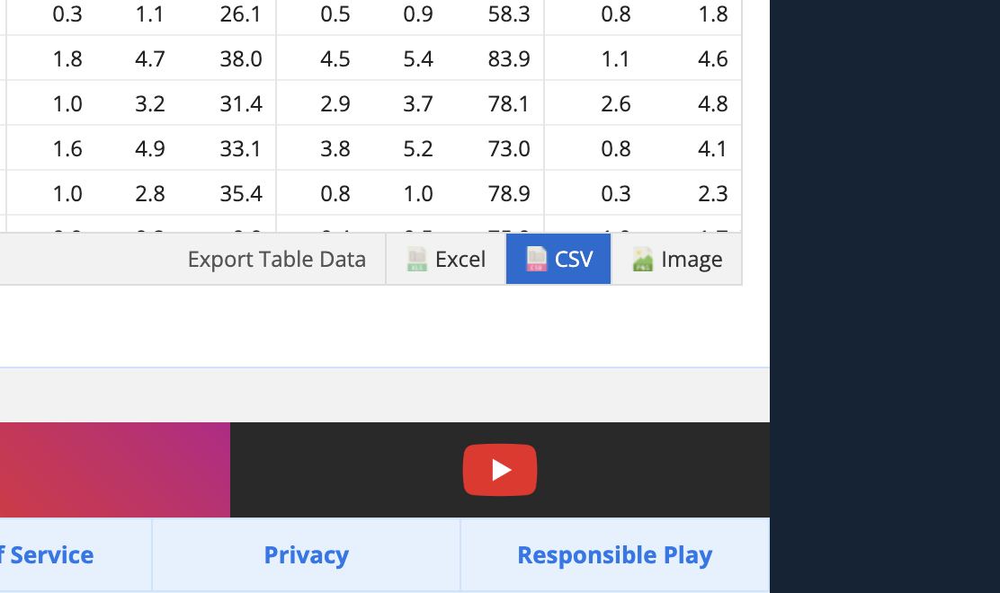
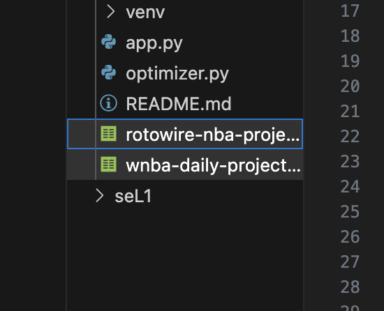
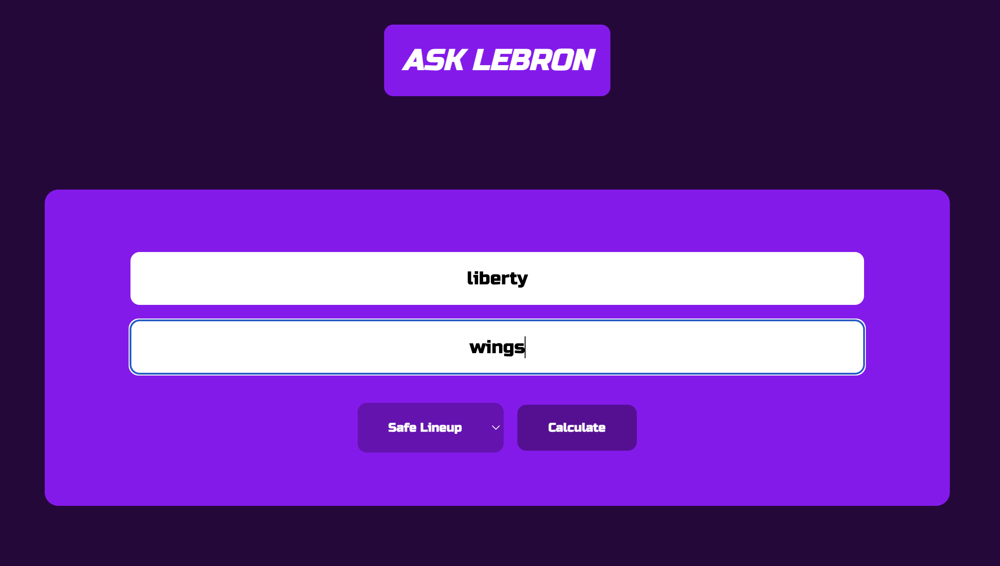
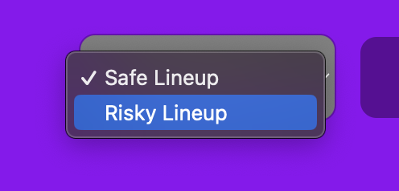
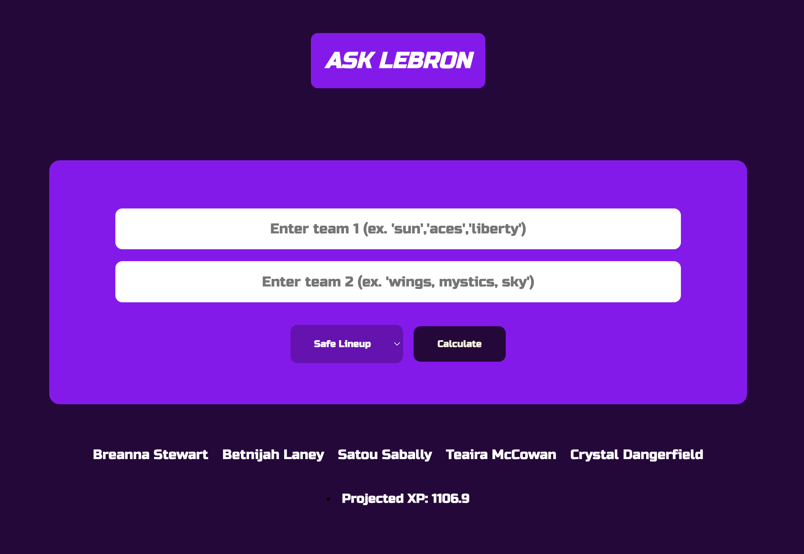

#                   AskLebron 
### A Daily Fantasy Lineup Optimizer

[Stadium Live App](https://stadiumverse.com/) is an immersive digital playground where sports fans form communities and compete in daily fantasy matches. With over 500,000 users, Stadium Live is one of the fastest growing online hubs that revolves around sports and culture. 

## Overview
The fantasy-aspect of Stadium Live challenges players to create winning 8-player lineup combinations, earning valuable rewards such as xp, coins, and collectible items. AskLebron is a powerful tool designed to revolutionize lineup creation within Stadium Live.

## Key Features

### 1. Data-Driven Decisions
:nerd_face: Our optimizer harnesses the immense power of daily Rotowire projection data, ensuring your lineups are always based on the latest and most accurate player statistics.

### 2. Lineup Optimization 
:smiling_imp: Statistical optimization algorithms crunches the numbers to generate lineup combinations that are statistically proven to maximize XP, coin, and collectible earnings. 

### 3. User-Friendly Interface 
:yellow_heart: AskLebron carries a sleek interface that allows for intuitive navigation, giving all users a competitive edge regardless of their experience level.

### 4. Customization
:cold_face: AskLebron tailors to your lineup preferences and strategies. The risk level toggle adapts to "high-risk-high-reward" users along with users aiming for steady wins. 

## Setup and Installation

### Requirements
1. [Python](https://realpython.com/installing-python/)
2. [Flask](https://flask.palletsprojects.com/en/2.3.x/installation/)
3. [Pandas](https://pandas.pydata.org/docs/getting_started/install.html)
4. [git](https://git-scm.com/book/en/v2/Getting-Started-Installing-Git)
5. [virtualenv](https://docs.python.org/3/library/venv.html) (recommended)
5. [pip](https://pip.pypa.io/en/stable/installation/)

### Installation
1. Clone the git: git clone https://github.com/steventanyang/AskLebron
2. Go into main directory
3. Run python3 app.py

## Usage

### 1. Download Rotowire Projection Data (CSV file) 
(Select "Daily" under projection type)
NBA: https://www.rotowire.com/basketball/projections.php?type=daily
WNBA: https://www.rotowire.com/wnba/projections-daily.php

### 2. Replace Projection Data Files

### 3. Choose a league

### 4. Enter team nanes

### 5. Select Risk Level

### 6. Optimize

## Roadmap
[x] add wnba
[x] update ui
[x] add risk level algorithm
[ ] add nfl
[ ] rotowire api fetching
[ ] display player headshots